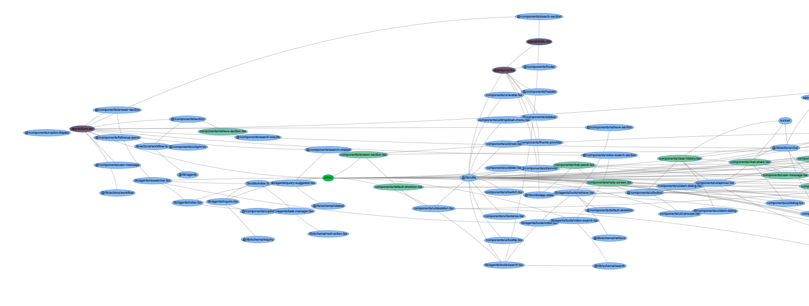

# DOT to Interactive HTML Graph Converter



A Python script to convert DOT files into interactive HTML graphs using PyVis. Features include hierarchical layouts, colored clusters, and the ability to collapse or expand nodes by clicking on them.

## Features

- **Hierarchical Layout:** Organizes nodes from left to right for enhanced readability.
- **Colored Clusters/Groups:** Assigns unique colors to different clusters for easy differentiation.
- **Interactive Collapse/Expand:** Click on a node to hide or reveal its connected nodes and edges.
- **Customizable Styles:** Easily modify node and edge styles through the script.

## Installation

1. **Clone the Repository:**

    ```bash
    git clone https://github.com/yourusername/dot-to-html-graph.git
    cd dot-to-html-graph
    ```

2. **Create a Virtual Environment (Optional but Recommended):**

    ```bash
    python3 -m venv env
    source env/bin/activate  # On Windows: env\Scripts\activate
    ```

3. **Install Dependencies:**

    ```bash
    pip install -r requirements.txt
    ```

    **`requirements.txt`:**
    ```plaintext
    pyvis
    networkx
    pydot
    ```

## Usage

1. **Prepare Your DOT File:**

    Ensure your DOT file is correctly formatted. You can use tools like [Graphviz](https://graphviz.org/) to validate and visualize your DOT files.

2. **Run the Script:**

    ```bash
    python generate_interactive_graph.py path/to/your/file.dot
    ```

    Replace `path/to/your/file.dot` with the actual path to your DOT file.

3. **View the Generated HTML:**

    After running the script, an `interactive_graph.html` file will be created in the working directory. Open this file in your web browser to explore the interactive graph.

    ```bash
    python generate_interactive_graph.py dependency_graph.dot
    ```

    This command will generate an `interactive_graph.html` file based on the `dependency_graph.dot` input.

## Example

To generate an interactive graph from a DOT file named `dependency_graph.dot`, run:

```bash
python generate_interactive_graph.py dependency_graph.dot
```


## Acknowledgements

- [PyVis](https://pyvis.readthedocs.io/en/latest/)
- [NetworkX](https://networkx.org/)
- [Graphviz](https://graphviz.org/)